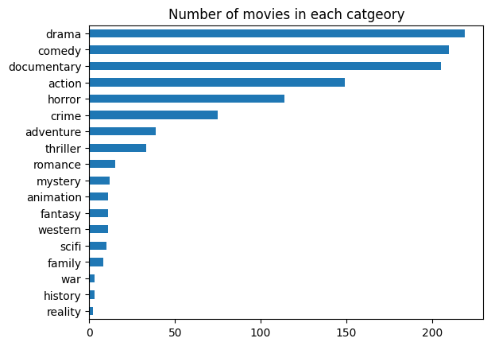
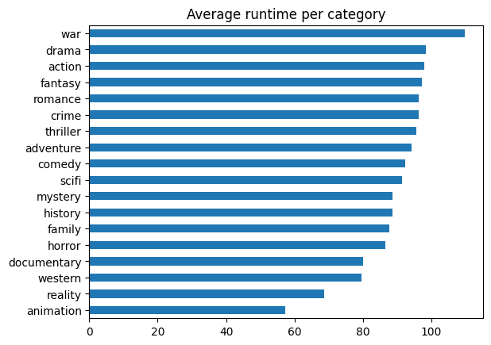
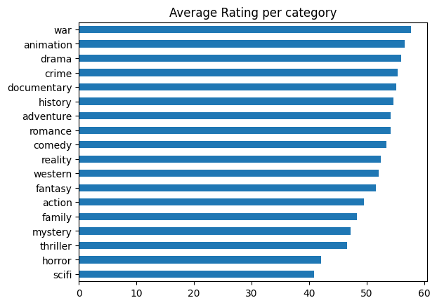

# Python-EDA
A Python EDA project, using API for data collection (Movies dataset)

### API Link
Rapid API - Streaming Availability [https://rapidapi.com/movie-of-the-night-movie-of-the-night-default/api/streaming-availability/playground/apiendpoint_6bc643c3-6726-4a29-bc7b-f9851732d251](url)

### Overview 
Analysis for 1130 US movies, 15 columns, from 1920 until 2024
The focus on this project is to analyse what does people prefer more in terms of movies they consume, and provide recommendations to production and streaming platfroms accordingly. 

#### Objectives & Key Findings
1. What is the number of movies released per year?

From the mid 2000s we can see a spike in the number movies released per years. This could be the result of movies becoming increasngly more accessible as the number of streaming platforms increased, and people started watching more movies during their free time.

3. Is there a correlation between the runtime and the rating of a movie?

There is a positive correlation between a movie runtime and its rating but it is only 0.26

4. What is the number of movies per category?

Drama, Comedy, and Documentary are the top three categories, followed by action, horror and crime.

5. What is the average runtime/rating per category?

War movies usually have a really long runtime which is around 109 mins (around 2 hours).
This may impact the rating of the movies (corr +0.26), However, animation movies are usually only around 57 mins (1 hour) and they do very well in terms of the average rating.

Despite the low number of movies listed, both War and Animation Movies seems to have the highest average rating amongst all categories. Which means although less people are watching it, the others who do, seems to enjoy it a lot. So, it is recommended for streaming services to do targeted marketing campgains, for the people who like watching War/animation movies, as well as providing other movie options from the same genre as well to retain them as subscribers.

#### Conclusion
War movies, and animation are popular despite their low numbers of movies produced each year. Production/streaming companies could try focusing their budget and resources on releasing new movies in these genres, as well as adding exisiting movies to more streaming platforms to appeal to exisiting audience. As mentioned previosuly, since the number of movies released recently have been increasing, targeted campaigns promoting said genres could assist in increasing people's awarness about these movies thus attracing new viewers as well.
